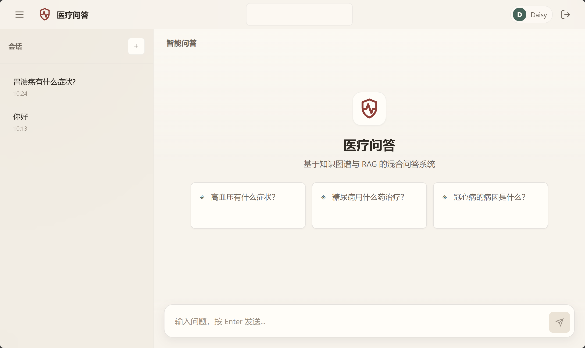

# 医疗知识问答系统

基于 `Spring Boot + LangChain4j + Vue 3` 的医疗问答系统，当前实现的是一套并行的 `RAG + 知识图谱` 混合检索方案。

系统的核心目标不是单纯做“聊天”，而是把两类能力接到同一个问答入口：

- `RAG`：面向上传文档和向量知识库的语义检索
- `知识图谱`：面向 `kgdrug` 数据集的结构化事实查询

项目当前已经具备完整前后端、登录注册、会话管理、流式输出、多轮对话记忆和知识库文档管理能力。



## 当前功能

- 混合问答：优先尝试知识图谱查询，失败后回退到 RAG
- 知识图谱查询：基于 `kgdrug` 的 TDB2 本地数据集，支持模板匹配和 LLM 生成 SPARQL
- RAG 检索：文档上传、切分、向量化、pgvector 相似度检索
- 流式回答：前端通过 SSE 接收流式输出，聊天区逐步渲染
- 多轮对话记忆：当当前问题缺少实体时，会根据最近用户消息补全上下文
- 用户体系：登录、注册、注销、用户隔离的知识库和聊天会话
- 会话管理：按最新活跃时间倒序排列，支持查看历史和删除会话
- 知识库管理：支持上传 `PDF / Word / TXT`，查看处理状态和删除文档

## 技术栈

| 类别 | 技术 |
|------|------|
| 后端 | Java 17, Spring Boot 3.5, MyBatis-Plus |
| AI 框架 | LangChain4j 1.12 |
| 前端 | Vue 3, Vite, Pinia, Vue Router, Element Plus |
| 向量存储 | PostgreSQL 16 + pgvector |
| 知识图谱 | Apache Jena TDB2 |
| 模型提供方 | SiliconFlow |

当前默认模型配置来自 [application.yml](E:/Github_project/LangChain4j-KGQA/backend/src/main/resources/application.yml)：

- Embedding: `Qwen/Qwen3-Embedding-8B`
- Chat: `MiniMaxAI/MiniMax-M2.5`

这些都可以通过环境变量覆盖。

## 架构概览

```text
                ┌────────────────────────────┐
                │        Vue 3 Frontend      │
                │ Chat / Knowledge / History │
                └──────────────┬─────────────┘
                               │
                               ▼
                ┌────────────────────────────┐
                │   Spring Boot Backend      │
                │ QA / Auth / Knowledge API  │
                └──────────────┬─────────────┘
                               │
          ┌────────────────────┴────────────────────┐
          ▼                                         ▼
┌──────────────────────┐                 ┌──────────────────────┐
│      RAG Pipeline    │                 │    KG Query Path     │
│ Embed -> pgvector    │                 │ Entity -> SPARQL     │
│ -> TopK -> LLM       │                 │ -> TDB2 -> LLM       │
└──────────────────────┘                 └──────────────────────┘
          │                                         │
          └────────────────────┬────────────────────┘
                               ▼
                     ┌────────────────────┐
                     │   Unified Answer   │
                     │ Answer + Sources   │
                     └────────────────────┘
```

问答链路的关键点：

1. 当前问题先做意图识别和实体抽取
2. 如果命中 `kgdrug` 实体，优先走知识图谱查询
3. 图谱无结果时回退到 RAG
4. 当前问题缺少实体但属于承接型追问时，会从最近历史中提取实体并重写问题
5. 回答通过流式接口返回到前端

## 目录结构

```text
LangChain4j-KGQA/
├── backend/
│   ├── src/main/java/com/kgqa/
│   │   ├── config/
│   │   ├── controller/
│   │   ├── service/
│   │   │   ├── qa/
│   │   │   ├── rag/
│   │   │   └── sparql/
│   │   ├── kg/
│   │   ├── model/
│   │   └── repository/
│   └── src/main/resources/
├── frontend/
│   └── src/
│       ├── api/
│       ├── components/
│       ├── router/
│       ├── stores/
│       └── views/
├── apache jena/
│   └── tdb_drug_new/
└── uploads/
```

## 数据与存储

### 1. PostgreSQL + pgvector

用于存储：

- 用户表 `app_user`
- 知识库元数据 `knowledge_base`
- 文档切块 `knowledge_chunk`
- 聊天会话 `chat_session`
- 聊天消息 `chat_message`
- LangChain4j 维护的向量表 `embeddings`

初始化脚本见 [schema.sql](E:/Github_project/LangChain4j-KGQA/backend/src/main/resources/schema.sql)。

### 2. Apache Jena TDB2

当前仅保留 `kgdrug` 数据集，不再使用 `wikidata`。

- 默认 TDB 路径：`E:/Github_project/LangChain4j-KGQA/apache jena/tdb_drug_new`
- 本体基地址：`http://www.kgdrug.com`

注意：

- TDB2 同时只允许一个 JVM 可靠写入/访问同一数据目录
- 如果目录存在 `tdb.lock`，通常说明有进程仍在占用

## 快速开始

### 环境要求

- JDK 17+
- Maven 3.8+
- Node.js 18+
- PostgreSQL 16+（或 Docker）

### 1. 启动 PostgreSQL + pgvector

```bash
docker run --name kgqa-postgres -p 5432:5432 ^
  -e POSTGRES_USER=postgres ^
  -e POSTGRES_PASSWORD=123456 ^
  -e POSTGRES_DB=kgqa ^
  -d pgvector/pgvector:0.8.2-pg18-trixie
```

### 2. 配置环境变量

至少需要：

```bash
SILICONFLOW_API_KEY=your_api_key
```

可选配置：

```bash
KGQA_DB_URL=jdbc:postgresql://localhost:5432/kgqa
KGQA_DB_USERNAME=postgres
KGQA_DB_PASSWORD=123456
KGQA_TDB_PATH=E:/Github_project/LangChain4j-KGQA/apache jena/tdb_drug_new
KGQA_AUTH_TOKEN_SECRET=replace_me
KGQA_DEFAULT_ADMIN_USERNAME=admin
KGQA_DEFAULT_ADMIN_PASSWORD=admin123
```

### 3. 启动后端

```bash
cd backend
mvn clean compile
mvn spring-boot:run
```

后端默认地址：`http://localhost:8080`

### 4. 启动前端

```bash
cd frontend
npm install
npm run dev
```

前端默认地址：`http://localhost:5173`

## 认证说明

系统已经实现登录和注册，不再是匿名问答。

- 鉴权接口：`/api/auth/login`、`/api/auth/register`、`/api/auth/me`、`/api/auth/logout`
- 认证令牌由后端写入 `HttpOnly Cookie`
- 前端不会把 token 暴露在 `localStorage`
- 不同用户的知识库、会话和历史记录彼此隔离

## API

### 问答

| Method | Path | 说明 |
|--------|------|------|
| POST | `/api/qa/chat` | 非流式问答 |
| POST | `/api/qa/chat/stream` | SSE 流式问答 |
| GET | `/api/qa/sessions` | 获取当前用户会话列表 |
| DELETE | `/api/qa/sessions/{id}` | 删除指定会话 |

### 认证

| Method | Path | 说明 |
|--------|------|------|
| POST | `/api/auth/login` | 登录 |
| POST | `/api/auth/register` | 注册 |
| GET | `/api/auth/me` | 获取当前用户 |
| POST | `/api/auth/logout` | 注销 |

### 聊天历史

| Method | Path | 说明 |
|--------|------|------|
| GET | `/api/chat/history/{sessionId}` | 获取会话历史 |
| DELETE | `/api/chat/history/{sessionId}` | 清空会话历史 |

### 知识库

| Method | Path | 说明 |
|--------|------|------|
| POST | `/api/knowledge/upload` | 上传文档 |
| GET | `/api/knowledge/list` | 获取知识库列表 |
| DELETE | `/api/knowledge/{id}` | 删除知识条目 |
| GET | `/api/knowledge/{id}/status` | 获取处理状态 |

### 导入与调试

| Method | Path | 说明 |
|--------|------|------|
| POST | `/api/import/tdb` | 导入 TDB 数据 |
| POST | `/api/import/csv` | 导入 CSV 数据 |
| POST | `/api/import/textbook` | 导入教材文本 |
| GET | `/api/qa/test/triples` | 查看三元组 |
| POST | `/api/qa/test/sparql` | 执行调试 SPARQL |

## 当前前端页面

- `/login`：登录 / 注册
- `/`：聊天问答页
- `/knowledge`：知识库管理页
- `/history`：历史会话页

## 当前实现上的约束

- 知识图谱当前只围绕 `kgdrug` 数据集，不包含 `wikidata`
- 流式输出依赖后端 SSE 和前端打字机式渲染
- 多轮记忆现在是“最近实体补全 + 追问改写”策略，不是完整会话摘要记忆
- RAG 检索质量强依赖上传文档质量和向量库内容

## 开发说明

常用命令：

```bash
cd backend
mvn clean compile

cd frontend
npm run build
```

如果你要调整系统行为，优先关注这些位置：

- [HybridQAServiceImpl.java](E:/Github_project/LangChain4j-KGQA/backend/src/main/java/com/kgqa/service/qa/impl/HybridQAServiceImpl.java)
- [RAGPipelineImpl.java](E:/Github_project/LangChain4j-KGQA/backend/src/main/java/com/kgqa/service/rag/impl/RAGPipelineImpl.java)
- [SPARQLTemplateMatcherImpl.java](E:/Github_project/LangChain4j-KGQA/backend/src/main/java/com/kgqa/service/sparql/impl/SPARQLTemplateMatcherImpl.java)
- [ChatView.vue](E:/Github_project/LangChain4j-KGQA/frontend/src/views/ChatView.vue)

## License

MIT
